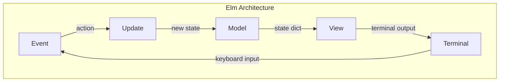
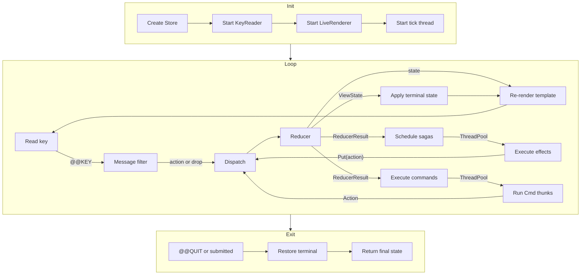
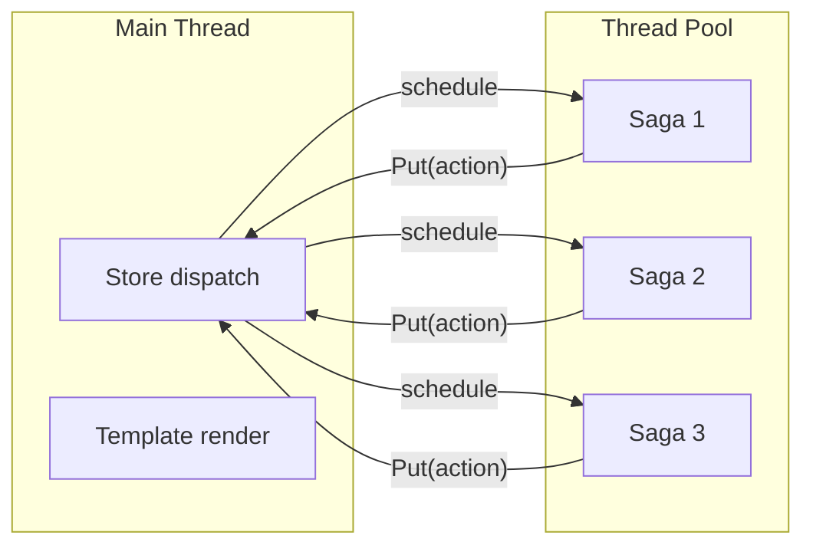

Milo implements the Elm Architecture (Model-View-Update) for terminal applications. This page explains the pattern and how each piece maps to Milo's API.

## The Elm Architecture

The Elm Architecture is a pattern for building interactive applications with three parts:

1. **Model** — the application state
2. **View** — a function that renders state to output
3. **Update** — a function that handles events and returns new state

Every state transition is explicit. There are no hidden mutations, no event bus, no two-way bindings.

## How Milo maps the pattern

| Elm concept | Milo implementation |
|-------------|-------------------|
| Model | Plain dicts or frozen dataclasses |
| View | Kida templates (`.kida` files) + `ViewState` for terminal features |
| Update | Reducer functions: `(state, action) -> state` |
| Commands | `Cmd` thunks (one-shot) or sagas (multi-step generators) |
| Subscriptions | `tick_rate`, `TickCmd`, `SIGWINCH` handler, `KeyReader` |
| Runtime | `App` event loop + `Store` |

## App lifecycle

## Why this pattern for CLIs

Traditional CLI frameworks use imperative control flow — `input()` calls, print statements, state scattered across variables. This works for simple tools but breaks down with:

:::{tab-set}
:::{tab-item} Problem

- Multi-screen wizards with back-navigation
- Async operations with progress indicators
- Session recording and replay
- Snapshot testing
- State that needs to survive across screen transitions

:::{/tab-item}

:::{tab-item} Elm Architecture solution

- **Navigation** — `FlowState` tracks current screen, preserves all screen states
- **Async** — Sagas yield `Call` effects, store dispatches `@@EFFECT_RESULT`
- **Recording** — Middleware logs every action; replay feeds them back to the reducer
- **Testing** — `assert_state(reducer, initial, actions, expected)` — no UI needed
- **Persistence** — State is a single serializable dict

:::{/tab-item}
:::{/tab-set}

## Free-threading

Milo's architecture is naturally suited to Python 3.14t free-threading:

- **Reducers** are pure functions — no shared mutable state
- **State** is immutable — safe to read from any thread
- **Sagas** run on `ThreadPoolExecutor` — true parallel execution without GIL contention
- **Store dispatch** is serialized through a lock — actions are processed one at a time

:::{note}
The `_Py_mod_gil = 0` marker tells CPython that Milo is safe to use without the GIL. This is set in `milo/__init__.py` per PEP 703.
:::
