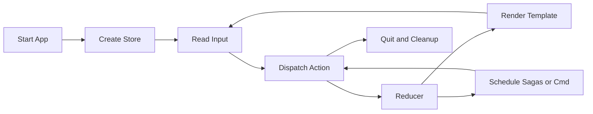

A Milo app starts a store, reads terminal input, dispatches actions, renders a
Kida template, and restores the terminal on exit.

Reducers decide state. Effects do work. The runtime owns terminal setup and
cleanup.
