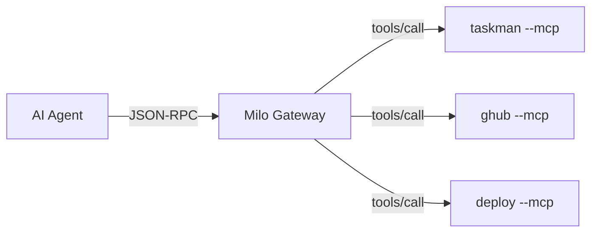

Every Milo CLI can run as an [MCP (Model Context Protocol)](https://modelcontextprotocol.io/) server, exposing eligible registered commands as tools that AI agents can discover and invoke. Milo serves the locked **MCP 2026-07-28 release candidate** over stdio and dependency-free ASGI HTTP, plus the legacy **MCP 2025-11-25** revision over stdio. The final 2026-07-28 specification is scheduled for July 28, 2026; Milo will re-run its conformance audit against that publication before calling support final.

Commands registered with `surfaces` that omit `"mcp"` are neither advertised
by `tools/list` nor callable through `tools/call`. This is appropriate for
long-running server commands; for example,
`@cli.command("serve", surfaces=("cli",))`. The same command remains available
to terminal and programmatic callers.



## Quick start

### Single CLI as MCP server

```bash
myapp --mcp
```

The server prints a startup banner to stderr with available tools and example requests, then listens on stdin/stdout for JSON-RPC messages.

### Register with an AI host

Claude Code, Cursor, and other MCP hosts can connect directly:

```bash
claude mcp add --transport stdio myapp -- \
  uv run python /absolute/path/to/examples/taskman/app.py --mcp
```

### Gateway for multiple CLIs

If you have several Milo CLIs, register them once and run a single gateway:

```bash
# Register each CLI
myapp --mcp-install
taskman --mcp-install

# Run the gateway
uv run python -m milo.gateway --mcp
```

The gateway discovers all registered CLIs and exposes their tools under namespaced names (e.g. `taskman.add`, `myapp.deploy`).

---

## Running as an MCP server

```bash
myapp --mcp
```

This starts a JSON-RPC server on stdin/stdout. The server writes a startup banner to stderr:

```
MCP server ready — myapp
  Protocols: 2026-07-28, 2025-11-25
  Tools:     3 (add, list, stats)
  Transport: stdin/stdout (JSON-RPC, one request per line)

Send requests as JSON, for example:
  {"jsonrpc":"2.0","id":1,"method":"server/discover"}
  Legacy clients may initialize with protocol 2025-11-25.
  {"jsonrpc":"2.0","id":3,"method":"tools/call","params":{"name":"add","arguments":{"title":"..."}}}

Or pipe from a file:
  cat requests.jsonl | myapp --mcp

Press Ctrl+C to stop.
```

## Streamable HTTP and ASGI

`CLI.asgi_app()` exposes the same handler and schemas as a dependency-free ASGI
3 callable. The HTTP binding serves stateless MCP 2026-07-28 only; legacy
2025-11-25 clients continue to use `--mcp` over stdio.

```python milo-docs:compile
from milo import CLI

cli = CLI(name="weather")


@cli.command("forecast")
def forecast(city: str) -> dict[str, str]:
    """Return a forecast.

    Args:
        city: City to forecast.
    """
    return {"city": city, "condition": "sunny"}


mcp_app = cli.asgi_app()
```

Mount `mcp_app` at `/mcp` in an existing ASGI host, or configure another path
with `cli.asgi_app(path="/agent/mcp")`. Milo offloads synchronous command
dispatch to worker threads, so a Python 3.14t process can execute independent
tool calls in parallel. Shared state inside command handlers remains the
application's locking responsibility.

### Local standalone mode

The base package contains the ASGI app. The optional `http` extra adds only the
standalone Uvicorn adapter:

```bash
pip install 'milo-cli[http]'
python app.py --mcp-http --port 8000
```

Standalone mode defaults to `127.0.0.1:8000`. Milo refuses an unauthenticated
non-loopback bind. `--allow-unauthenticated` is an explicit unsafe override for
deployments where a trusted reverse proxy owns authentication; authenticated
Python deployments should configure `cli.asgi_app(...)` directly.

### Bearer tokens and protected-resource metadata

Configure a sync or async bearer-token callback together with an RFC 9728
metadata document:

```python milo-docs:skip reason=deployment-callback-example
async def validate_access_token(token: str) -> bool:
    claims = await identity_provider.validate(token)
    return claims.audience == "https://mcp.example.com/mcp"


mcp_app = cli.asgi_app(
    token_validator=validate_access_token,
    protected_resource_metadata={
        "resource": "https://mcp.example.com/mcp",
        "authorization_servers": ["https://identity.example.com"],
        "scopes_supported": ["tools:call"],
    },
    allowed_origins=["https://agent.example.com"],
)
```

The callback owns signature, expiry, issuer, audience, and scope validation.
Milo accepts bearer tokens only from the `Authorization` header, returns a
`WWW-Authenticate` challenge on 401, and serves the protected-resource
metadata at the RFC 9728 well-known path. Requests without `Origin` are
accepted; requests that include it must match `allowed_origins` exactly.

### HTTP request contract

Every `/mcp` request is one POST with `Content-Type: application/json` and an
`Accept` header containing both `application/json` and `text/event-stream`.
The required `MCP-Protocol-Version`, `Mcp-Method`, and applicable `Mcp-Name`
headers must match the JSON-RPC body. Milo decodes the specification's Base64
sentinel form, validates recognized `Mcp-Param-*` tool headers, and returns
`HeaderMismatch` (`-32020`) with HTTP 400 on disagreement. Request bodies are
bounded to 1 MiB by default.

Commands that yield `Progress` produce request-scoped SSE notifications before
the final JSON-RPC response. Ordinary calls return one `application/json`
response. Milo exposes no roots, sampling, elicitation, or other server-to-
client request API, so it does not currently emit `InputRequiredResult` MRTR
responses.

### Verify both transports

```bash
milo verify app.py --transport both
```

The combined report retains the stdio checks and adds
`mcp_http_transport` plus `mcp_apps_http_transport`. HTTP verification calls
the ASGI app directly; it installs no adapter and opens no socket.

## Protocol support

The 2026-07-28 path is stateless: clients may probe `server/discover`, then put
the protocol revision, client identity, and client capabilities in `_meta` on
every request. There is no modern `initialize`/`notifications/initialized`
handshake. Milo keeps that handshake only for 2025-11-25 clients during the
revision's compatibility window.

An unsupported explicit revision returns `UnsupportedProtocolVersionError`
(`-32022`) with `data.supported` and `data.requested`. A modern request missing
required metadata returns Invalid params (`-32602`).

### Compatibility matrix

| Scenario | Expected behavior |
|---|---|
| Modern MCP client → Milo server | Client sends `server/discover`, then self-contained requests with the three required `_meta` fields. Milo returns 2026-07-28 result and cache metadata. |
| Legacy MCP client → Milo server | Client sends `initialize`, then `notifications/initialized`, then normal requests. Milo responds as MCP `2025-11-25`. |
| Probe-first client → Milo server | Milo returns `supportedVersions: ["2026-07-28", "2025-11-25"]`; the client selects the first revision it supports. |
| Client sends unsupported `_meta` protocol version | Milo returns JSON-RPC `-32022` with `data.supported` and `data.requested` repair fields. |
| Milo gateway → legacy child CLI | Gateway probes `server/discover`, falls back to `initialize` on method-not-found, and records child protocol mode as `legacy`. |
| Milo gateway → modern child CLI | Gateway uses the discovered revision and includes client metadata plus incoming W3C Trace Context on every child call. |
| Modern HTTP client → `cli.asgi_app()` | Each POST carries 2026-07-28 metadata and matching routing headers; Milo returns JSON or request-scoped SSE. |
| Legacy HTTP client → `cli.asgi_app()` | Milo returns HTTP 400 with `-32022`; legacy sessions, GET streams, and `Mcp-Session-Id` are intentionally not implemented. |

The detailed [2026-07-28 conformance matrix](https://github.com/lbliii/milo-cli/blob/main/docs/mcp-2026-07-28-conformance.md) records implemented, legacy-only, not-advertised, and transport-deferred features.

The server handles these methods:

### server/discover

```json
{
  "jsonrpc": "2.0",
  "id": 1,
  "method": "server/discover",
  "params": {
    "_meta": {
      "io.modelcontextprotocol/protocolVersion": "2026-07-28",
      "io.modelcontextprotocol/clientInfo": {"name": "my-client", "version": "1.0"},
      "io.modelcontextprotocol/clientCapabilities": {}
    }
  }
}
```

Returns supported protocol versions, server info, capabilities, and
instructions:

```json
{
  "resultType": "complete",
  "supportedVersions": ["2026-07-28", "2025-11-25"],
  "capabilities": {"tools": {}, "resources": {}, "prompts": {}},
  "serverInfo": {
    "name": "myapp",
    "version": "1.0.0",
    "title": "My CLI application"
  },
  "instructions": "My CLI application"
}
```

### initialize

`initialize` and `notifications/initialized` are legacy-only. A 2026-07-28
request for either removed method returns Method not found (`-32601`).

```json
{
  "jsonrpc": "2.0",
  "id": 1,
  "method": "initialize",
  "params": {
    "protocolVersion": "2025-11-25",
    "clientInfo": {"name": "legacy-client", "version": "1.0"},
    "capabilities": {}
  }
}
```

Returns protocol version, server info (with `title`), and capabilities:

```json
{
  "protocolVersion": "2025-11-25",
  "capabilities": {"tools": {}},
  "serverInfo": {
    "name": "myapp",
    "version": "1.0.0",
    "title": "My CLI application"
  },
  "instructions": "My CLI application"
}
```

### notifications/initialized

```json
{"jsonrpc": "2.0", "method": "notifications/initialized"}
```

Legacy client confirmation after `initialize`. No response is sent.

### tools/list

```json
{
  "jsonrpc": "2.0",
  "id": 2,
  "method": "tools/list",
  "params": {
    "_meta": {
      "io.modelcontextprotocol/protocolVersion": "2026-07-28",
      "io.modelcontextprotocol/clientInfo": {"name": "my-client", "version": "1.0"},
      "io.modelcontextprotocol/clientCapabilities": {}
    }
  }
}
```

Returns commands whose `surfaces` include `"mcp"` as tools with full schemas:

```json
{
  "resultType": "complete",
  "ttlMs": 30000,
  "cacheScope": "private",
  "tools": [
    {
      "name": "greet",
      "title": "Greet",
      "description": "Say hello",
      "inputSchema": {
        "type": "object",
        "properties": {
          "name": {"type": "string"},
          "loud": {"type": "boolean"}
        },
        "required": ["name"]
      },
      "outputSchema": {
        "type": "string"
      }
    },
    {
      "name": "site.build",
      "title": "Build the documentation site",
      "description": "Build the site",
      "inputSchema": { "..." : "..." }
    }
  ]
}
```

Each tool includes:

| Field | Source | Description |
|---|---|---|
| `name` | Command name | Dot-notation for groups: `site.build`, `site.config.show` |
| `title` | Handler docstring first line, or title-cased name | Human-readable display name |
| `description` | `@cli.command(description=...)` | Short description |
| `inputSchema` | Parameter type annotations | JSON Schema for arguments |
| `outputSchema` | Return type annotation | JSON Schema for the return value (when available) |

Modern `tools/list`, `resources/list`, and `prompts/list` results use a
30-second private cache hint. `resources/read` is private and immediately
stale (`ttlMs: 0`). Legacy responses omit `resultType`, `ttlMs`, and
`cacheScope`. Unknown resource URIs return Invalid params (`-32602`).

### tools/call

```json
{
  "jsonrpc": "2.0", "id": 3,
  "method": "tools/call",
  "params": {
    "name": "greet",
    "arguments": {"name": "Alice", "loud": true},
    "_meta": {
      "io.modelcontextprotocol/protocolVersion": "2026-07-28",
      "io.modelcontextprotocol/clientInfo": {"name": "my-client", "version": "1.0"},
      "io.modelcontextprotocol/clientCapabilities": {}
    }
  }
}
```

Dispatches to the command handler and returns the result as MCP content:

```json
{
  "resultType": "complete",
  "content": [{"type": "text", "text": "HELLO, ALICE!"}]
}
```

When a handler returns structured data (dict, list, number, bool), the response also includes `structuredContent`:

```json
{
  "resultType": "complete",
  "content": [{"type": "text", "text": "{\n  \"id\": 1,\n  \"status\": \"done\"\n}"}],
  "structuredContent": {"id": 1, "status": "done"}
}
```

This lets MCP clients consume typed data directly instead of parsing text.

For modern calls, Milo makes the request `_meta` available to a handler as
`ctx.globals["mcp"]`. The gateway preserves `traceparent`, `tracestate`, and
`baggage` so a W3C trace can continue through a namespaced child call.

Before middleware reaches a handler, Milo validates tool arguments against the
same `inputSchema` returned by `tools/list`. Required and unexpected arguments,
primitive types, enums, string and array lengths, regex patterns, uniqueness,
and inclusive or exclusive numeric bounds are enforced. String-sourced
numbers, booleans, JSON arrays, and JSON objects are coerced when valid.
Failures return `isError: true` with `M-INP-004` through `M-INP-007`, the
affected `argument`, a machine-readable `reason` and `constraint`, a repair
`suggestion`, and the advertised schema. The handler is never called with a
value that fails these checks.

---

## MCP Apps UI resources

Milo implements the stable
[MCP Apps 2026-01-26 extension](https://github.com/modelcontextprotocol/ext-apps/blob/main/specification/2026-01-26/apps.mdx)
as an optional layer over normal tools and resources. A linked command must
still return useful text and structured data for clients that do not support
embedded UIs.

```python milo-docs:compile
from milo import (
    CLI,
    MCPAppCSP,
    MCPAppResourceMeta,
    MCPAppToolMeta,
)

cli = CLI(name="weather")


@cli.ui_resource(
    "ui://weather/forecast",
    name="Weather forecast",
    meta=MCPAppResourceMeta(
        csp=MCPAppCSP(connect_domains=("https://api.weather.example",)),
        prefers_border=True,
    ),
)
def forecast_view() -> str:
    return "<!doctype html><html><body><main id='forecast'></main></body></html>"


@cli.command("forecast", ui=MCPAppToolMeta("ui://weather/forecast"))
def forecast(city: str) -> dict[str, str]:
    return {"city": city, "condition": "sunny"}
```

`ui_resource()` reserves the `ui://` scheme and the exact
`text/html;profile=mcp-app` MIME profile. Its handler returns a valid HTML5
document as `str`, or bytes that Milo serializes as a deterministic base64
`blob`. Normal `resource()` registrations cannot claim the reserved scheme.

### Capability negotiation

A modern host opts in per request through
`_meta["io.modelcontextprotocol/clientCapabilities"]`. A legacy host opts in
during `initialize`:

```json
{
  "capabilities": {
    "extensions": {
      "io.modelcontextprotocol/ui": {
        "mimeTypes": ["text/html;profile=mcp-app"]
      }
    }
  }
}
```

When negotiated, Milo returns the same extension capability, adds nested
`_meta.ui.resourceUri` metadata to linked tools, and exposes UI resources from
`resources/list` and `resources/read`. Without negotiation, model-visible tools
remain ordinary text/structured tools, UI metadata is omitted, and UI resources
are not advertised. Reading a `ui://` resource without negotiation returns the
structured `M-UI-003` error.

Milo emits only the stable nested `_meta.ui` form. The deprecated flat
`_meta["ui/resourceUri"]` key is intentionally unsupported.

### Visibility and link integrity

`MCPAppToolMeta` defaults to `visibility=("model", "app")`. Use
`visibility=("app",)` for implementation tools that an embedded app knows by
name but the model must not see. Milo omits app-only tools from its model-facing
`tools/list`; hosts remain responsible for origin-sensitive app call policy
because core `tools/call` does not identify the iframe caller to the server.

Every advertised tool link must resolve to a resource registered on the same
server. Missing links fail discovery with `M-UI-002` and include `tool` and
`resourceUri` repair fields instead of advertising a broken UI.

### Security metadata and ownership

`MCPAppResourceMeta` serializes CSP domains, requested browser permissions, an
optional host-specific domain, and the border preference deterministically.
Milo transports this declaration but does not render HTML, create iframes,
grant permissions, validate a host-specific domain, or enforce browser CSP.
Those are MCP Apps host responsibilities. Resource handlers should return
static, reviewable HTML and avoid embedding secrets.

### Gateway namespacing and lifecycle

The Milo gateway acts as an MCP Apps-capable client to every child CLI, then
exposes UI metadata only when the upstream host negotiated the extension. A
child link such as `ui://weather/dashboard` is rewritten deterministically:

```text
ui://milo-gateway/weather/ui%3A%2F%2Fweather%2Fdashboard
```

Both `tools/list._meta.ui.resourceUri` and `resources/list[].uri` use that
gateway URI. `resources/read` routes it to the owning child with the original
URI, then rewrites the returned content URI back to the gateway URI. MIME,
security metadata, text or blob content, and structured tool results pass
through unchanged.

The encoded child name makes identical child URIs collision-safe. Duplicate
tool, resource, or prompt entries from one child use deterministic first-wins
discovery and emit a gateway warning. Malformed UI resources are omitted, and a
tool's broken UI link is removed instead of advertising an unresolvable URI.

Without upstream negotiation, UI resources and `_meta.ui` are omitted while
the tool's text and structured fallback remains available. Unknown gateway UI
URIs return `M-UI-002`; unnegotiated reads return `M-UI-003`; and child
disconnect, timeout, parse, or unavailable errors return `M-UI-004` with
`child`, `reason`, and resource URI repair fields.

### Verify conformance before registration

Run `milo verify app.py` before an MCP host opens a linked UI. Three stable
check identities isolate the broken view:

| Check | Contract |
|---|---|
| `mcp_apps_in_process` | Discovery and negotiated capabilities agree; tool links resolve; listed resources have valid URI, MIME/profile, metadata, and readable text/base64 payloads |
| `mcp_apps_gateway` | A real single-child gateway projection rewrites each link and preserves resource/tool metadata |
| `mcp_apps_transport` | The same capability, list, link, and resource-read checks pass over subprocess JSON-RPC |
| `mcp_http_transport` | Modern discovery, cache metadata, and tool lists pass through the dependency-free ASGI HTTP binding |
| `mcp_apps_http_transport` | Negotiated MCP Apps tool/resource links and reads pass through ASGI HTTP |

These failures exit 1 and include the next repair action. Schema documentation
warnings still exit 0. Milo validates transport shape only: it does not parse,
sanitize, render, or otherwise interpret the application HTML.

See the runnable
[dependency-free interactive MCP Apps example](https://github.com/lbliii/milo-cli/tree/main/examples/mcp_app).

---

## Schema generation

Schemas are generated automatically from function type annotations.

### Input schemas

Generated from handler parameters via `function_to_schema()`:

| Python | JSON Schema |
|---|---|
| `str` | `"string"` |
| `int` | `"integer"` |
| `float` | `"number"` |
| `bool` | `"boolean"` |
| `list[str]` | `"array"` with string items |
| `dict` | `"object"` |
| `X \| None` | unwrapped to base type, not required |

Context parameters (`ctx: Context`) are excluded from schemas.

### Output schemas

Generated from handler return type annotations via `return_to_schema()`. If a handler declares `-> dict` or `-> list[str]`, the corresponding JSON Schema appears as `outputSchema` in `tools/list`.

```python milo-docs:compile
@cli.command("stats", description="Get task statistics")
def stats() -> dict:
    return {"total": 10, "done": 7}
```

This produces `"outputSchema": {"type": "object"}` in the tool definition.

---

## Registry and gateway

For projects with multiple Milo CLIs, the registry and gateway let you expose all of them through a single MCP connection.

### Registering a CLI

```bash
myapp --mcp-install
```

This writes the CLI's name, command, description, and version to Milo's
platform registry: `~/.milo/registry.json` on Unix or
`%LOCALAPPDATA%\milo\registry.json` on Windows. The registry is a simple JSON
file:

```json
{
  "version": 1,
  "clis": {
    "taskman": {
      "command": ["python", "examples/taskman/app.py", "--mcp"],
      "description": "A simple task manager",
      "version": "0.1.0"
    }
  }
}
```

To remove a CLI:

```bash
myapp --mcp-uninstall
```

### Running the gateway

The gateway is a meta-MCP server that discovers and proxies all registered CLIs:

```bash
uv run python -m milo.gateway --mcp
```

On startup, the gateway:

1. Reads `registry.json` from Milo's platform data directory
2. Spawns each registered CLI and negotiates supported child capabilities
3. Discovers tools, resources, and prompts in parallel
4. Namespaces tools as `cli_name.tool_name` and rewrites MCP Apps resource links
5. Listens on stdin/stdout for MCP requests

```
milo gateway ready
  Protocols: 2026-07-28, 2025-11-25
  CLIs:      2 (taskman, ghub)
  Tools:     8
  Available: taskman.add, taskman.list, taskman.done, ghub.repo.list, ...
```

When an agent calls `taskman.add`, the gateway:
1. Looks up `taskman` in the routing table
2. Spawns `taskman --mcp`
3. Sends a modern self-contained `tools/call`, or a legacy `initialize` followed by `tools/call`, with the original tool name (`add`)
4. Returns the result to the agent

### Listing registered CLIs

```bash
uv run python -m milo.gateway --list
```

### Connecting the gateway to an AI host

Register the gateway once:

```bash
claude mcp add --transport stdio milo -- uv run python -m milo.gateway --mcp
```

Now every CLI registered via `--mcp-install` is discoverable through the single `milo` MCP server. Tools are namespaced: `taskman.add`, `ghub.repo.list`, etc.

---

## Hidden commands

Commands marked `hidden=True`, including commands beneath hidden groups, are
excluded from `tools/list` and rejected by `tools/call` with structured
`M-CMD-001` repair data. The gateway routes only names returned by discovery,
so hidden tools cannot be reached through a namespaced gateway call either.
Commands whose `surfaces` omit `"mcp"` follow the same list/call enforcement
without being hidden from their other selected surfaces.

## Lazy commands and MCP

Lazy commands with pre-computed schemas appear in `tools/list` without importing their handler modules. The import only happens on `tools/call`. This keeps MCP startup fast even with heavy dependencies.

```python
cli.lazy_command(
    "deploy",
    "myapp.deploy:run_deploy",
    description="Deploy to production",
    schema={
        "type": "object",
        "properties": {"target": {"type": "string"}},
        "required": ["target"],
    },
)
```

The `outputSchema` and `title` fields are also deferred for lazy commands — they only resolve when the handler is first imported.

:::{tip}
Combine with `--llms-txt` to give AI agents both an MCP tool interface and a human-readable discovery document.
:::
