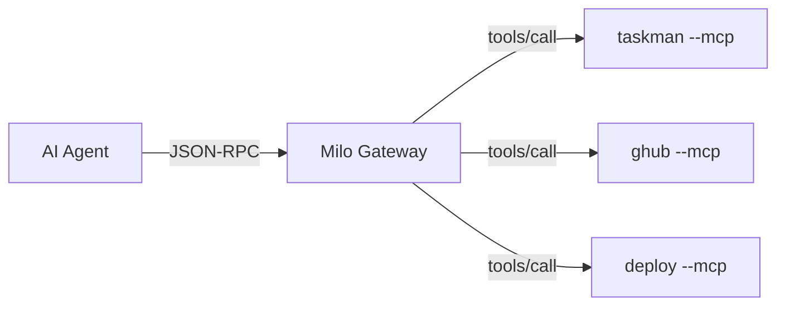

Every Milo CLI can run as an [MCP (Model Context Protocol)](https://modelcontextprotocol.io/) server, exposing eligible registered commands as tools that AI agents can discover and invoke. Milo implements the **MCP 2025-11-25** specification.

Commands registered with `surfaces` that omit `"mcp"` are neither advertised
by `tools/list` nor callable through `tools/call`. This is appropriate for
long-running server commands; for example,
`@cli.command("serve", surfaces=("cli",))`. The same command remains available
to terminal and programmatic callers.



## Quick start

### Single CLI as MCP server

```bash
myapp --mcp
```

The server prints a startup banner to stderr with available tools and example requests, then listens on stdin/stdout for JSON-RPC messages.

### Register with an AI host

Claude Code, Cursor, and other MCP hosts can connect directly:

```bash
claude mcp add --transport stdio myapp -- \
  uv run python /absolute/path/to/examples/taskman/app.py --mcp
```

### Gateway for multiple CLIs

If you have several Milo CLIs, register them once and run a single gateway:

```bash
# Register each CLI
myapp --mcp-install
taskman --mcp-install

# Run the gateway
uv run python -m milo.gateway --mcp
```

The gateway discovers all registered CLIs and exposes their tools under namespaced names (e.g. `taskman.add`, `myapp.deploy`).

---

## Running as an MCP server

```bash
myapp --mcp
```

This starts a JSON-RPC server on stdin/stdout. The server writes a startup banner to stderr:

```
MCP server ready — myapp
  Protocol:  2025-11-25
  Tools:     3 (add, list, stats)
  Transport: stdin/stdout (JSON-RPC, one request per line)

Send requests as JSON, for example:
  {"jsonrpc":"2.0","id":1,"method":"initialize"}
  {"jsonrpc":"2.0","id":2,"method":"tools/list"}
  {"jsonrpc":"2.0","id":3,"method":"tools/call","params":{"name":"add","arguments":{"title":"..."}}}

Or pipe from a file:
  cat requests.jsonl | myapp --mcp

Press Ctrl+C to stop.
```

## Protocol support

Milo implements the MCP 2025-11-25 specification and keeps the
initialization handshake for current clients. It also exposes
`server/discover` so clients preparing for stateless MCP revisions can
detect the supported protocol version before deciding whether to use the
legacy handshake.

When a request includes explicit per-request MCP metadata with an
unsupported protocol version, Milo returns JSON-RPC error `-32004` with
the supported versions instead of silently treating the request as
2025-11-25.

### Compatibility matrix

| Scenario | Expected behavior |
|---|---|
| Legacy MCP client → Milo server | Client sends `initialize`, then `notifications/initialized`, then normal requests. Milo responds as MCP `2025-11-25`. |
| Probe-first client → Milo server | Client sends `server/discover`. Milo returns `supportedVersions: ["2025-11-25"]`; the client can then use the legacy handshake. |
| Client sends unsupported `_meta` protocol version | Milo returns JSON-RPC `-32004` with `data.supported` and `data.requested` repair fields. |
| Milo gateway → legacy child CLI | Gateway probes `server/discover`, falls back to `initialize` on method-not-found, and records child protocol mode as `legacy`. |
| Milo gateway → stateless-only child CLI | Gateway uses the discovered protocol version and includes per-request `_meta` on child calls. |

The server handles these methods:

### server/discover

```json
{"jsonrpc": "2.0", "id": 1, "method": "server/discover"}
```

Returns supported protocol versions, server info, capabilities, and
instructions:

```json
{
  "supportedVersions": ["2025-11-25"],
  "capabilities": {"tools": {}},
  "serverInfo": {
    "name": "myapp",
    "version": "1.0.0",
    "title": "My CLI application"
  },
  "instructions": "My CLI application"
}
```

### initialize

```json
{"jsonrpc": "2.0", "id": 1, "method": "initialize"}
```

Returns protocol version, server info (with `title`), and capabilities:

```json
{
  "protocolVersion": "2025-11-25",
  "capabilities": {"tools": {}},
  "serverInfo": {
    "name": "myapp",
    "version": "1.0.0",
    "title": "My CLI application"
  },
  "instructions": "My CLI application"
}
```

### notifications/initialized

```json
{"jsonrpc": "2.0", "method": "notifications/initialized"}
```

Client confirmation after `initialize`. No response is sent (per MCP spec).

### tools/list

```json
{"jsonrpc": "2.0", "id": 2, "method": "tools/list"}
```

Returns commands whose `surfaces` include `"mcp"` as tools with full schemas:

```json
{
  "tools": [
    {
      "name": "greet",
      "title": "Greet",
      "description": "Say hello",
      "inputSchema": {
        "type": "object",
        "properties": {
          "name": {"type": "string"},
          "loud": {"type": "boolean"}
        },
        "required": ["name"]
      },
      "outputSchema": {
        "type": "string"
      }
    },
    {
      "name": "site.build",
      "title": "Build the documentation site",
      "description": "Build the site",
      "inputSchema": { "..." : "..." }
    }
  ]
}
```

Each tool includes:

| Field | Source | Description |
|---|---|---|
| `name` | Command name | Dot-notation for groups: `site.build`, `site.config.show` |
| `title` | Handler docstring first line, or title-cased name | Human-readable display name |
| `description` | `@cli.command(description=...)` | Short description |
| `inputSchema` | Parameter type annotations | JSON Schema for arguments |
| `outputSchema` | Return type annotation | JSON Schema for the return value (when available) |

### tools/call

```json
{
  "jsonrpc": "2.0", "id": 3,
  "method": "tools/call",
  "params": {
    "name": "greet",
    "arguments": {"name": "Alice", "loud": true}
  }
}
```

Dispatches to the command handler and returns the result as MCP content:

```json
{
  "content": [{"type": "text", "text": "HELLO, ALICE!"}]
}
```

When a handler returns structured data (dict, list, number, bool), the response also includes `structuredContent`:

```json
{
  "content": [{"type": "text", "text": "{\n  \"id\": 1,\n  \"status\": \"done\"\n}"}],
  "structuredContent": {"id": 1, "status": "done"}
}
```

This lets MCP clients consume typed data directly instead of parsing text.

Before middleware reaches a handler, Milo validates tool arguments against the
same `inputSchema` returned by `tools/list`. Required and unexpected arguments,
primitive types, enums, string and array lengths, regex patterns, uniqueness,
and inclusive or exclusive numeric bounds are enforced. String-sourced
numbers, booleans, JSON arrays, and JSON objects are coerced when valid.
Failures return `isError: true` with `M-INP-004` through `M-INP-007`, the
affected `argument`, a machine-readable `reason` and `constraint`, a repair
`suggestion`, and the advertised schema. The handler is never called with a
value that fails these checks.

---

## Schema generation

Schemas are generated automatically from function type annotations.

### Input schemas

Generated from handler parameters via `function_to_schema()`:

| Python | JSON Schema |
|---|---|
| `str` | `"string"` |
| `int` | `"integer"` |
| `float` | `"number"` |
| `bool` | `"boolean"` |
| `list[str]` | `"array"` with string items |
| `dict` | `"object"` |
| `X \| None` | unwrapped to base type, not required |

Context parameters (`ctx: Context`) are excluded from schemas.

### Output schemas

Generated from handler return type annotations via `return_to_schema()`. If a handler declares `-> dict` or `-> list[str]`, the corresponding JSON Schema appears as `outputSchema` in `tools/list`.

```python milo-docs:compile
@cli.command("stats", description="Get task statistics")
def stats() -> dict:
    return {"total": 10, "done": 7}
```

This produces `"outputSchema": {"type": "object"}` in the tool definition.

---

## Registry and gateway

For projects with multiple Milo CLIs, the registry and gateway let you expose all of them through a single MCP connection.

### Registering a CLI

```bash
myapp --mcp-install
```

This writes the CLI's name, command, description, and version to Milo's
platform registry: `~/.milo/registry.json` on Unix or
`%LOCALAPPDATA%\milo\registry.json` on Windows. The registry is a simple JSON
file:

```json
{
  "version": 1,
  "clis": {
    "taskman": {
      "command": ["python", "examples/taskman/app.py", "--mcp"],
      "description": "A simple task manager",
      "version": "0.1.0"
    }
  }
}
```

To remove a CLI:

```bash
myapp --mcp-uninstall
```

### Running the gateway

The gateway is a meta-MCP server that discovers and proxies all registered CLIs:

```bash
uv run python -m milo.gateway --mcp
```

On startup, the gateway:

1. Reads `registry.json` from Milo's platform data directory
2. Spawns each registered CLI and calls `tools/list` to discover its tools
3. Namespaces all tools as `cli_name.tool_name`
4. Listens on stdin/stdout for MCP requests

```
milo gateway ready
  Protocol:  2025-11-25
  CLIs:      2 (taskman, ghub)
  Tools:     8
  Available: taskman.add, taskman.list, taskman.done, ghub.repo.list, ...
```

When an agent calls `taskman.add`, the gateway:
1. Looks up `taskman` in the routing table
2. Spawns `taskman --mcp`
3. Sends an `initialize` + `tools/call` request with the original tool name (`add`)
4. Returns the result to the agent

### Listing registered CLIs

```bash
uv run python -m milo.gateway --list
```

### Connecting the gateway to an AI host

Register the gateway once:

```bash
claude mcp add --transport stdio milo -- uv run python -m milo.gateway --mcp
```

Now every CLI registered via `--mcp-install` is discoverable through the single `milo` MCP server. Tools are namespaced: `taskman.add`, `ghub.repo.list`, etc.

---

## Hidden commands

Commands marked `hidden=True`, including commands beneath hidden groups, are
excluded from `tools/list` and rejected by `tools/call` with structured
`M-CMD-001` repair data. The gateway routes only names returned by discovery,
so hidden tools cannot be reached through a namespaced gateway call either.
Commands whose `surfaces` omit `"mcp"` follow the same list/call enforcement
without being hidden from their other selected surfaces.

## Lazy commands and MCP

Lazy commands with pre-computed schemas appear in `tools/list` without importing their handler modules. The import only happens on `tools/call`. This keeps MCP startup fast even with heavy dependencies.

```python
cli.lazy_command(
    "deploy",
    "myapp.deploy:run_deploy",
    description="Deploy to production",
    schema={
        "type": "object",
        "properties": {"target": {"type": "string"}},
        "required": ["target"],
    },
)
```

The `outputSchema` and `title` fields are also deferred for lazy commands — they only resolve when the handler is first imported.

:::{tip}
Combine with `--llms-txt` to give AI agents both an MCP tool interface and a human-readable discovery document.
:::
