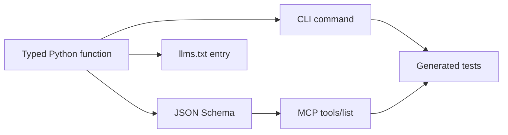

This guide starts with Milo's core contract: one typed Python function becomes a
human CLI command, an MCP tool with a JSON Schema, and an llms.txt entry.

:::{checklist} What You'll Learn
:show-progress:
- [ ] Scaffold a minimal Milo CLI
- [ ] Run the command from argv
- [ ] Inspect the generated help and llms.txt output
- [ ] Run the generated contract tests
- [ ] Verify the CLI as an agent-facing MCP server
:::{/checklist}

## Create a CLI

```bash
uv run milo new my_cli
cd my_cli
```

The scaffold creates this small project:

```text
my_cli/
  app.py
  conftest.py
  README.md
  tests/
    __init__.py
    test_app.py
```

The generated `app.py` contains one typed command:

```python
from milo import CLI

cli = CLI(name="my_cli", description="What it does", version="0.1")


@cli.command("greet", description="Return a greeting")
def greet(name: str, loud: bool = False) -> str:
    """Greet someone by name.

    Args:
        name: The person to greet.
        loud: If true, SHOUT.
    """
    message = f"Hello, {name}!"
    return message.upper() if loud else message


if __name__ == "__main__":
    cli.run()
```

The function signature is the contract. `name: str` becomes a required CLI
option and MCP schema field. `loud: bool = False` becomes an optional flag with a
default.

## Run It

```bash
uv run python app.py greet --name Alice
```

Expected output:

```text
Hello, Alice!
```

Boolean defaults become flags:

```bash
uv run python app.py greet --name Alice --loud
```

Expected output:

```text
HELLO, ALICE!
```

## Inspect Help

```bash
uv run python app.py --help
uv run python app.py greet --help
```

Milo generates help from the registered command, type annotations, defaults, and
docstrings. Keep parameter descriptions in the `Args:` section so humans and
agents see the same contract.

## Inspect llms.txt

```bash
uv run python app.py --llms-txt
```

Look for the generated command entry:

```text
**greet**: Return a greeting
  Parameters: `--name` (string, **required**), `--loud` (boolean, optional, default: False)
```

The llms.txt output is a readable catalog. MCP clients use the JSON Schema from
`tools/list`; both are generated from the same Python function.

## Test the Contract

```bash
uv run pytest tests/ -v
```

The generated tests cover four layers:

| Layer | What it protects |
|---|---|
| Schema | `function_to_schema(greet)` matches the function signature |
| Direct dispatch | `cli.invoke([...])` parses argv and returns the expected value |
| MCP dispatch | `_call_tool(cli, {...})` returns content or structured `errorData` |
| Verify | `milo verify app.py` passes import, schema, tools/list, and transport checks |

## Verify for Agents

```bash
uv run milo verify app.py
```

A healthy scaffold reports six passing checks:

```text
✓ imports: loaded app.py
✓ cli_located: found CLI instance (name='my_cli')
✓ commands_registered: 1 command(s) registered
✓ schemas_generate: 1 schema(s) generated; all params documented
✓ mcp_list_tools: 1 tool(s) listed with valid inputSchema
✓ mcp_transport: subprocess handshake succeeded; 1 tool(s) over JSON-RPC
```

Warnings tell you what to improve, such as missing parameter descriptions.
Failures mean the CLI is not safe to register as an MCP tool yet.

## Register with an MCP Host

Claude Code and other MCP hosts can launch your CLI over stdin/stdout:

```bash
claude mcp add my_cli -- uv run python /absolute/path/to/my_cli/app.py --mcp
```

MCP uses stdout for JSON-RPC. Do not write progress logs with `print()` from
library or handler code that may run under `--mcp`; use `Context` output helpers
or stderr boundary code instead.

## What Just Happened?



Milo keeps command resolution, schema generation, programmatic calls, and MCP
dispatch tied to one definition. That is the part to preserve as your CLI grows.

## Next Steps

:::{cards}
:columns: 2
:gap: medium

:::{card} CLI & Commands
:icon: terminal
:link: ../build-clis/commands/
:description: Typed commands, built-in flags, output formats, and completions
:::{/card}

:::{card} MCP Server
:icon: cpu
:link: ../build-clis/mcp/
:description: Expose commands as tools and use the Milo gateway
:::{/card}

:::{card} Testing
:icon: check-circle
:link: ../quality/testing/
:description: Schema, dispatch, MCP, verify, snapshots, and replay
:::{/card}

:::{card} Interactive Apps
:icon: layers
:link: ../applied-tutorials/build-a-counter/
:description: Build a reducer-driven terminal app with Kida templates
:::{/card}

:::{/cards}
