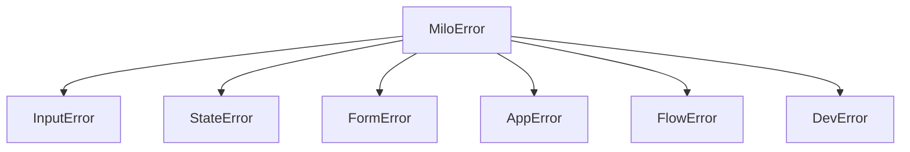

Milo uses a structured error hierarchy with namespaced error codes for precise debugging.

## Error hierarchy



All Milo errors extend `MiloError(code, message)`:

| Exception | Subsystem | Code prefix |
|-----------|-----------|-------------|
| `InputError` | Key reader, raw mode, escape sequences | `M-INP-*` |
| `StateError` | Store, dispatch, reducers, sagas | `M-STA-*` |
| `FormError` | Form fields, validation, navigation | `M-FRM-*` |
| `AppError` | Event loop, rendering, lifecycle | `M-APP-*` |
| `FlowError` | Flow screens, transitions, navigation | `M-FLW-*` |
| `DevError` | Dev server, file watching, hot reload | `M-DEV-*` |

## Error codes

The `ErrorCode` enum defines all known error codes:

:::{tab-set}
:::{tab-item} Input

| Code | Name | Description |
|------|------|-------------|
| `M-INP-001` | `INPUT_RAW_MODE` | Failed to enter raw terminal mode |
| `M-INP-002` | `INPUT_READ` | Error reading from stdin |
| `M-INP-003` | `INPUT_SEQUENCE` | Unrecognized escape sequence |

:::{/tab-item}

:::{tab-item} State

| Code | Name | Description |
|------|------|-------------|
| `M-STA-001` | `STATE_DISPATCH` | Error during action dispatch |
| `M-STA-002` | `STATE_REDUCER` | Reducer raised an exception |
| `M-STA-003` | `STATE_SAGA` | Saga execution failed |

:::{/tab-item}

:::{tab-item} Form

| Code | Name | Description |
|------|------|-------------|
| `M-FRM-001` | `FORM_VALIDATION` | Field validation error |
| `M-FRM-002` | `FORM_FIELD` | Invalid field configuration |

:::{/tab-item}

:::{tab-item} App / Flow / Dev

| Code | Name | Description |
|------|------|-------------|
| `M-APP-001` | `APP_RENDER` | Template rendering error |
| `M-APP-002` | `APP_LIFECYCLE` | Event loop lifecycle error |
| `M-FLW-001` | `FLOW_NAVIGATE` | Invalid screen navigation |
| `M-FLW-002` | `FLOW_TRANSITION` | No transition defined |
| `M-DEV-001` | `DEV_WATCH` | File watching error |

:::{/tab-item}
:::{/tab-set}

## Catching errors

```python
from milo import MiloError, StateError

try:
    store.dispatch(action)
except StateError as e:
    print(f"[{e.code}] {e.message}")
except MiloError as e:
    print(f"Milo error: {e}")
```

:::{tip}
Catch specific subclasses (`StateError`, `FormError`) when you can handle them. Catch `MiloError` as a fallback for unexpected errors.
:::
