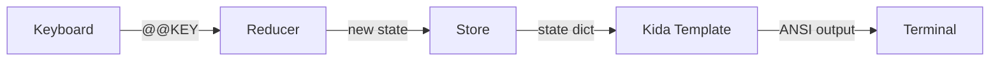

This tutorial walks through a simple counter app: the smallest useful
interactive Milo program.

:::{checklist} What You'll Learn
:show-progress:
- [ ] Write a pure reducer function
- [ ] Create a Kida terminal template
- [ ] Wire them together with `App`
- [ ] Run with hot reload via `milo dev`
:::{/checklist}

## Build the Counter

:::{steps}
:::{step} Create a reducer
:description: A pure function that manages your state

A reducer takes the current state and an action, then returns the next state. It
does not mutate the old state.

```python
# app.py
from milo import App, Action


def reducer(state, action):
    if state is None:
        return {"count": 0}
    if action.type == "@@KEY" and action.payload.char == " ":
        return {**state, "count": state["count"] + 1}
    if action.type == "@@KEY" and action.payload.char == "r":
        return {**state, "count": 0}
    return state
```

The reducer handles three cases:

| Action | Condition | Result |
|--------|-----------|--------|
| `@@INIT` | `state is None` | Return default state `{"count": 0}` |
| `@@KEY` | `char == " "` | Increment counter |
| `@@KEY` | `char == "r"` | Reset counter to 0 |

:::{/step}

:::{step} Create a template
:description: Render state to the terminal with Kida

Milo uses [[ext:kida:|Kida]] templates for rendering. Create a template file:

```kida
{# counter.kida #}
Count: {{ count }}

[SPACE] Increment  [R] Reset  [Ctrl+C] Quit
```

Your state dict becomes the template context. `{{ count }}` renders the current
value of `state["count"]`.

:::{/step}

:::{step} Wire it together
:description: Create an App and run the event loop

```python
app = App(template="counter.kida", reducer=reducer, initial_state=None)
final_state = app.run()
print(f"Final count: {final_state['count']}")
```

`App` connects input, state, and rendering: it reads keyboard input, dispatches
`@@KEY` actions to the reducer, re-renders the template on each state change,
and returns the final state when the user quits.

:::{/step}

:::{step} Run it
:description: Start your app with hot reload

```bash
milo dev app:app --watch .
```

:::{/step}
:::{/steps}

:::{tip}
The `milo dev` command uses the `module:attribute` convention. `app:app` means
"import `app.py` and look up the `app` attribute." The `--watch` flag enables
hot reload, so template edits show up immediately.
:::

## What Just Happened?



1. **KeyReader** captures raw terminal input and produces `Key` objects.
2. **Store** dispatches `@@KEY` actions to your reducer.
3. **Reducer** returns new state.
4. **Kida template** renders state to terminal output.
5. **LiveRenderer** diffs and redraws changed lines.

This is Milo's Elm-style architecture: every state transition is explicit and
testable.

## Next Steps

:::{cards}
:columns: 2
:gap: medium

:::{card} State Management
:icon: database
:link: ../usage/state
:description: Store, middleware, combined reducers
:::{/card}

:::{card} Multi-Screen Flows
:icon: arrows-clockwise
:link: ../usage/flows
:description: Chain screens with the >> operator
:::{/card}

:::{card} Interactive Forms
:icon: textbox
:link: ../usage/forms
:description: Collect structured input with validation
:::{/card}

:::{card} Input Handling
:icon: keyboard
:link: ../usage/input
:description: Key objects, escape sequences, raw mode, and fallbacks
:::{/card}

:::{/cards}
