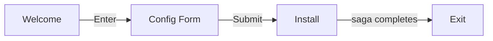

This tutorial walks you through building a multi-screen install wizard — the kind of interactive CLI you'd use for setting up a tool, configuring a service, or onboarding a user.

## What you'll build



A three-screen wizard:

1. **Welcome** — greet the user, explain what happens next
2. **Config** — collect a project name, environment, and confirmation via form fields
3. **Install** — run the install saga, show a progress bar, display results

:::{checklist} Prerequisites
:show-progress:
- [x] [[docs/get-started/installation|Milo installed]]
- [x] Python 3.14+
- [ ] Read the [[docs/get-started/quickstart|Quickstart]]
:::{/checklist}

## Build the Wizard

:::{steps}
:::{step} Define the screens
:description: Create three FlowScreens with templates and reducers

Each screen is a `FlowScreen` with its own template and reducer:

```python
from milo.flow import FlowScreen

welcome = FlowScreen("welcome", "welcome.txt", welcome_reducer)
config = FlowScreen("config", "config.txt", config_reducer)
install = FlowScreen("install", "install.txt", install_reducer)
```

:::{/step}

:::{step} Write the welcome reducer
:description: Advance on Enter

The welcome screen advances to config when the user presses Enter:

```python
def welcome_reducer(state, action):
    if state is None:
        return {"ready": False}
    if action.type == "@@KEY" and action.payload.name == "ENTER":
        return {**state, "ready": True, "submitted": True}
    return state
```

:::{/step}

:::{step} Write the config reducer
:description: Use form_reducer for structured input

The config screen uses `form_reducer` to handle form fields:

```python
from milo import FieldSpec, FieldType
from milo.form import form_reducer

config_specs = [
    FieldSpec("project", "Project name"),
    FieldSpec("env", "Environment", field_type=FieldType.SELECT,
              choices=("dev", "staging", "prod")),
    FieldSpec("confirm", "Proceed with install?",
              field_type=FieldType.CONFIRM),
]

def config_reducer(state, action):
    if state is None:
        return form_reducer({"specs": config_specs}, action)
    return form_reducer(state, action)
```

:::{/step}

:::{step} Write the install reducer and saga
:description: Trigger side effects with ReducerResult

The install screen triggers a saga on entry and tracks progress:

```python
from milo import ReducerResult, Call, Put, Delay, Action

def install_reducer(state, action):
    if state is None:
        return ReducerResult(
            {"progress": 0, "status": "installing", "log": []},
            sagas=(install_saga,),
        )
    if action.type == "PROGRESS":
        return {**state, "progress": action.payload}
    if action.type == "INSTALL_DONE":
        return {**state, "progress": 100, "status": "done",
                "log": action.payload}
    return state

def install_saga():
    for i in range(1, 11):
        yield Delay(0.3)
        yield Put(Action("PROGRESS", payload=i * 10))
    result = yield Call(run_install, ())
    yield Put(Action("INSTALL_DONE", payload=result))
```

:::{/step}

:::{step} Create the templates
:description: Kida templates for each screen

:::{tab-set}
:::{tab-item} welcome.txt

```kida
{{ "Install Wizard" | bold }}
{{ "=" * 40 | fg("dim") }}

This wizard will set up your project.

Press ENTER to continue.
```

:::{/tab-item}

:::{tab-item} config.txt

```kida

```

Uses the built-in form template.

:::{/tab-item}

:::{tab-item} install.txt

```kida
{{ "Installing..." | bold }}




{{ line }}



{{ "Done!" | fg("green") | bold }}

```

:::{/tab-item}
:::{/tab-set}

:::{/step}

:::{step} Wire it up
:description: Chain screens and run

```python
from milo import App

flow = welcome >> config >> install
app = App.from_flow(flow)
app.run()
```

:::{/step}
:::{/steps}

## Next steps

:::{dropdown} Ideas for extending this wizard
:icon: lightbulb

- Add validation to the config form with `FieldSpec.validator`
- Record the session with `record=True` for [[docs/usage/testing|replay testing]]
- Add a fourth "summary" screen that shows what was configured
- Add a custom transition to skip config: `flow.with_transition("welcome", "install", on="@@QUICK_INSTALL")`
- Handle install errors in the saga and dispatch an error action

:::
