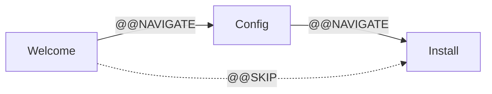

Flows let you build multi-screen terminal applications by chaining screens together with the `>>` operator. Each screen has its own template, reducer, and state slice — Milo handles navigation and state routing.



## Defining screens

A `FlowScreen` bundles a name, template, and reducer:

```python
from milo.flow import FlowScreen

def welcome_reducer(state, action):
    if state is None:
        return {"message": "Welcome to the installer"}
    if action.type == "@@KEY" and action.payload.name == "ENTER":
        return {**state, "submitted": True}
    return state

welcome = FlowScreen("welcome", "welcome.txt", welcome_reducer)
```

## Chaining screens

Use `>>` to create a flow:

```python
from milo import App
from milo.flow import FlowScreen

welcome = FlowScreen("welcome", "welcome.txt", welcome_reducer)
config = FlowScreen("config", "config.txt", config_reducer)
confirm = FlowScreen("confirm", "confirm.txt", confirm_reducer)

flow = welcome >> config >> confirm
app = App.from_flow(flow)
app.run()
```

:::{note}
The `>>` operator connects screens in sequence. When a screen sets `submitted: True`, the flow advances to the next screen by dispatching `@@NAVIGATE`.
:::

## Flow state

At runtime, Milo manages a `FlowState` that isolates each screen's state:

```python
FlowState(
    current_screen="welcome",
    screen_states={
        "welcome": {...},
        "config": {...},
        "confirm": {...},
    },
)
```

Each screen's reducer only sees its own slice of state. The flow's combined reducer routes actions to the current screen's reducer and handles `@@NAVIGATE` transitions.

:::{dropdown} How FlowState routing works
:icon: info

When the store dispatches an action:

1. The flow reducer checks `current_screen`
2. It passes the action to that screen's reducer with only that screen's state slice
3. If the reducer returns `submitted: True`, the flow auto-dispatches `@@NAVIGATE` to the next screen
4. `@@NAVIGATE` actions update `current_screen` and re-render with the new screen's template

Screen states persist across navigation — going back to a previous screen restores its state.

:::

## Custom transitions

Add non-sequential transitions with `with_transition`:

```python
flow = welcome >> config >> confirm
flow = flow.with_transition("welcome", "confirm", on="@@SKIP_CONFIG")
```

This lets you skip screens, loop back, or branch based on custom actions.

:::{tip}
Use custom transitions for optional screens, error recovery flows, or branching wizards. The flow state machine handles navigation — your reducers just dispatch the right action type.
:::

## Navigation actions

Dispatch `@@NAVIGATE` explicitly from a reducer to move between screens:

```python
from milo import Action, ReducerResult

def welcome_reducer(state, action):
    if action.type == "@@KEY" and action.payload.char == "s":
        return ReducerResult(
            {**state, "skipped": True},
            sagas=(),
        )
    return state
```

Or let the flow auto-advance when `state["submitted"]` becomes `True`.
