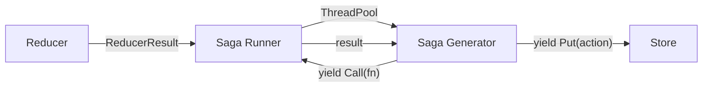

Sagas handle side effects in Milo — network requests, timers, file I/O, and anything else that isn't a pure state transformation. They're generator functions that yield effect descriptors, keeping your reducers pure.

## How sagas work



A saga is a generator that yields effect objects. The saga runner interprets each effect, executes it, and sends the result back into the generator.

```python
from milo import Call, Put, Select, Action

def fetch_data_saga():
    url = yield Select(lambda s: s["api_url"])
    data = yield Call(fetch_json, (url,))
    yield Put(Action("DATA_LOADED", payload=data))
```

Sagas run on a `ThreadPoolExecutor`, leveraging Python 3.14t free-threading for true parallelism.

## Triggering sagas from reducers

Return a `ReducerResult` to schedule sagas after a state transition:

```python
from milo import ReducerResult

def reducer(state, action):
    if action.type == "FETCH_REQUESTED":
        return ReducerResult(
            {**state, "loading": True},
            sagas=(fetch_data_saga,),
        )
    if action.type == "DATA_LOADED":
        return {**state, "loading": False, "data": action.payload}
    return state
```

:::{note}
The store dispatches the state change first, then schedules the sagas. This means your template will render the `loading: True` state before the saga begins executing.
:::

## Effect types

:::{tab-set}
:::{tab-item} Call
:icon: play

Execute a function and receive its return value:

```python
result = yield Call(my_function, (arg1, arg2), {"key": "value"})
```

The saga runner calls `my_function(arg1, arg2, key="value")` on the thread pool and sends the return value back into the generator.

:::{/tab-item}

:::{tab-item} Put

Dispatch an action back to the store:

```python
yield Put(Action("TASK_COMPLETE", payload=result))
```

:::{/tab-item}

:::{tab-item} Select

Read current state (or a slice of it):

```python
full_state = yield Select()
url = yield Select(lambda s: s["config"]["api_url"])
```

:::{/tab-item}

:::{tab-item} Fork

Launch a concurrent child saga on the thread pool:

```python
from milo import Fork

yield Fork(background_polling_saga)
```

Forked sagas run independently. They share the same store and can dispatch actions.

:::{/tab-item}

:::{tab-item} Delay

Sleep for a duration:

```python
from milo import Delay

yield Delay(2.0)  # Wait 2 seconds
```

:::{/tab-item}
:::{/tab-set}

## Composing sagas

:::{tab-set}
:::{tab-item} Sequential
:badge: yield from

Delegate to other sagas sequentially:

```python
def setup_saga():
    yield from fetch_config_saga()
    yield from fetch_user_saga()
    yield Put(Action("SETUP_COMPLETE"))
```

:::{/tab-item}

:::{tab-item} Concurrent
:badge: Fork

Run sagas in parallel on the thread pool:

```python
def parallel_setup_saga():
    yield Fork(fetch_config_saga)
    yield Fork(fetch_user_saga)
```

Under Python 3.14t free-threading, forked sagas execute with true parallelism.

:::{/tab-item}
:::{/tab-set}

:::{tip}
Keep sagas focused on coordination, not computation. If you need heavy processing, put it in a function and `Call` it — that way the saga remains readable and the function is independently testable.
:::

## Error recovery

If an unhandled exception occurs in a saga, Milo dispatches a `@@SAGA_ERROR` action instead of swallowing the error silently. Your reducer can handle it gracefully:

```python
def reducer(state, action):
    if action.type == "@@SAGA_ERROR":
        return {**state, "error": action.payload["error"]}
    return state
```

The payload contains `{"error": "message", "type": "ExceptionTypeName"}`.

:::{note}
The store continues working after a saga error — other sagas and dispatches are unaffected. This matches Bubbletea's pattern of recovering from panics in command goroutines.
:::

## Sagas vs. Commands

For one-shot effects (fetch a URL, write a file, dispatch the result), consider using [[docs/usage/commands-effects|Commands]] instead. Commands are simpler — a plain function instead of a generator — and handle the dispatch-result pattern automatically.

Use sagas when you need multi-step coordination: reading state mid-effect, retrying with backoff, forking child tasks, or sequencing multiple dependent calls.
