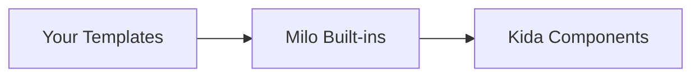

Milo renders terminal UI through [[ext:kida:|Kida]] templates — the same syntax you'd use for HTML, adapted for terminal output with ANSI colors and live rendering.

## Template loader chain

Milo's template environment searches three locations in order:



```python
from milo.templates import get_env

env = get_env()  # Pre-configured environment with all loaders
template = env.get_template("my_screen.txt")
```

## Built-in templates

| Template | Description |
|----------|-------------|
| `form.txt` | Full form layout — iterates field specs and renders each field |
| `field_text.txt` | Text/password input field with cursor |
| `field_select.txt` | Select field with `[x]` / `[ ]` radio indicators |
| `field_confirm.txt` | Yes/No confirm field |
| `help.txt` | argparse help output styled with Kida |
| `progress.txt` | Unicode progress bar (`█` / `░`) |

:::{tip}
Override any built-in template by placing a file with the same name in your template directory. The loader chain checks your templates first.
:::

## Writing templates

Templates use [[ext:kida:docs/syntax|Kida syntax]] (similar to Jinja2). Your state dict becomes the template context:

```kida
{# dashboard.txt #}
{{ "Status Dashboard" | bold }}
{{ "=" * 40 | fg("dim") }}


{{ service.name | ljust(20) }}{{ service.status | badge }}


Uptime: {{ uptime | duration }}
```

:::{dropdown} Common terminal filters
:icon: palette

| Filter | Effect |
|--------|--------|
| `bold` | Bold text |
| `dim` | Dimmed text |
| `fg("color")` | Foreground color (red, green, blue, cyan, etc.) |
| `bg("color")` | Background color |
| `ljust(n)` | Left-justify to n characters |
| `rjust(n)` | Right-justify to n characters |
| `center(n)` | Center to n characters |
| `badge` | Status badge (colored based on value) |

See the [[ext:kida:docs/usage/terminal|Kida terminal reference]] for the full filter list.

:::

## Live rendering

When running inside an `App`, Milo uses Kida's `LiveRenderer` for flicker-free terminal updates. The renderer diffs the previous and next output and only redraws changed lines.

If `LiveRenderer` is unavailable, Milo falls back to ANSI clear-screen writes (`\033[2J\033[H`).

## Static HTML rendering

For one-shot output (documentation, exports), use `render_html`:

```python
from milo import render_html

html = render_html(state={"count": 42}, template="counter.txt")
```

:::{note}
`render_html` renders the template once and returns the result as a string. It does not start an event loop or read keyboard input.
:::
