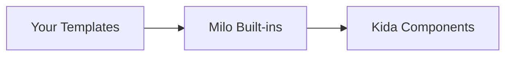

Milo renders terminal UI through [[ext:kida:|Kida]] templates — the same syntax you'd use for HTML, adapted for terminal output with ANSI colors and live rendering.

## Template loader chain

Milo's template environment searches three locations in order:



```python
from milo.templates import get_env

env = get_env()  # Pre-configured environment with all loaders
template = env.get_template("my_screen.kida")
```

## Built-in templates

| Template | Description |
|----------|-------------|
| `form.kida` | Full form layout — iterates field specs and renders each field |
| `field_text.kida` | Text/password input field with cursor |
| `field_select.kida` | Select field with `[x]` / `[ ]` radio indicators |
| `field_confirm.kida` | Yes/No confirm field |
| `help.kida` | argparse help output styled with Kida |
| `progress.kida` | Unicode progress bar (`█` / `░`) |

:::{tip}
Override any built-in template by placing a file with the same name in your template directory. The loader chain checks your templates first.
:::

## Template auto-discovery

`App.from_dir()` finds a `templates/` directory relative to the calling file and sets up the loader chain automatically:

```python
from milo import App

app = App.from_dir(
    __file__,
    template="dashboard.kida",
    reducer=reducer,
    initial_state=State(),
)
app.run()
```

This eliminates manual `FileSystemLoader` and `get_env()` setup. Pass `templates_dir="views"` to use a different directory name.

## Built-in component macros

Milo ships reusable template macros in `components/_defs.kida`. Import them into any template:

```kida

```

| Macro | Description |
|-------|-------------|
| `header(name, version, description)` | App banner with name, version, and description |
| `header_box(name, version, description)` | Boxed header with rounded border |
| `section(title, color)` | Colored section heading |
| `status_line(level, message, detail)` | Icon + message line (success, error, warning, info) |
| `kv_pair(label, value, width)` | Key-value pair with dot-fill alignment |
| `kv_list(items, width)` | List of key-value pairs |
| `def_list(items)` | Definition list (term + indented description) |
| `example_block(examples)` | Description + command examples |
| `tag_list(tags)` | Colored inline labels |
| `breadcrumb(parts, sep)` | Hierarchical path display |
| `command_row(name, description, aliases, tags)` | Command with aliases and tags |
| `key_hints(hints)` | Keyboard shortcut bar |
| `selectable_list(items, cursor, render, empty)` | Cursor-highlighted item list |
| `scrollable_list(items, cursor, render, height, scroll_offset, empty)` | Viewport slice with overflow indicators |
| `format_time(seconds)` | Seconds to `MM:SS.CC` format |

### Selectable list

Renders a cursor-navigable list. Pass a render macro that takes `(item, is_selected)`:

```kida



{{ icons.check | green }} {{ todo.text | dim }}
{{ icons.cross | red }} {{ todo.text }}


{{ selectable_list(visible, state.cursor, render_todo) }}
```

### Scrollable list

Like `selectable_list` but clips to a viewport height and shows "N more above/below" indicators:

```kida


{{ scrollable_list(state.entries, state.cursor, render_entry,
                   height=15, scroll_offset=state.scroll_offset) }}
```

### Format time

Converts seconds (float) to `MM:SS.CC`:

```kida


{{ format_time(state.elapsed) | bold | green }}
```

## Writing templates

Templates use [[ext:kida:docs/syntax|Kida syntax]] (similar to Jinja2). Your state dict becomes the template context:

```kida
{# dashboard.kida #}
{{ "Status Dashboard" | bold }}
{{ "=" * 40 | fg("dim") }}


{{ service.name | ljust(20) }}{{ service.status | badge }}


Uptime: {{ uptime | duration }}
```

:::{dropdown} Common terminal filters
:icon: palette

| Filter | Effect |
|--------|--------|
| `bold` | Bold text |
| `dim` | Dimmed text |
| `fg("color")` | Foreground color (red, green, blue, cyan, etc.) |
| `bg("color")` | Background color |
| `ljust(n)` | Left-justify to n characters |
| `rjust(n)` | Right-justify to n characters |
| `center(n)` | Center to n characters |
| `badge` | Status badge (colored based on value) |

See the [[ext:kida:docs/usage/terminal|Kida terminal reference]] for the full filter list.

:::

## Live rendering

When running inside an `App`, Milo uses Kida's `LiveRenderer` for flicker-free terminal updates. The renderer diffs the previous and next output and only redraws changed lines.

If `LiveRenderer` is unavailable, Milo falls back to ANSI clear-screen writes (`\033[2J\033[H`).

## Static HTML rendering

For one-shot output (documentation, exports), use `render_html`:

```python
from milo import render_html

html = render_html(state={"count": 42}, template="counter.kida")
```

:::{note}
`render_html` renders the template once and returns the result as a string. It does not start an event loop or read keyboard input.
:::
