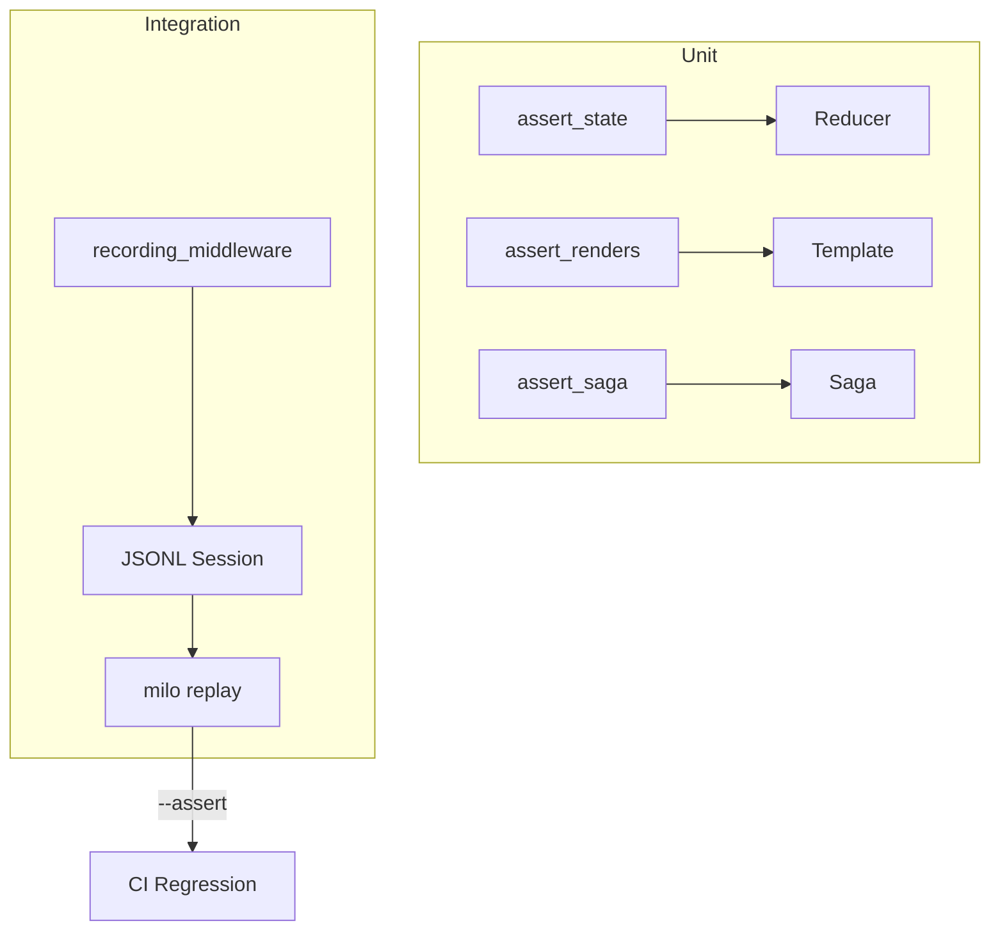

Milo ships with testing utilities purpose-built for the Elm Architecture. Test reducers with action sequences, test views with snapshots, test sagas step-by-step, and record/replay entire sessions.

## CLI command testing

Agent-facing CLIs should test the command contract before interactive behavior.
Use four small layers:

1. **Schema** — `function_to_schema(command)` matches the function signature.
2. **Direct dispatch** — `cli.invoke([...])` parses argv and returns the expected `InvokeResult`.
3. **MCP dispatch** — `_call_tool(cli, {...})` returns the same content and structured `errorData` on malformed input.
4. **Verify** — `milo.verify.verify("app.py")` passes the same import, discovery, schema, `tools/list`, and subprocess handshake checks as `milo verify`.

```python
from pathlib import Path

from milo.mcp import _call_tool
from milo.schema import function_to_schema
from milo.verify import verify

from app import cli, greet


def test_schema_matches_signature():
    schema = function_to_schema(greet)
    assert schema["required"] == ["name"]
    assert schema["properties"]["name"]["type"] == "string"


def test_direct_dispatch():
    result = cli.invoke(["greet", "--name", "Alice"])
    assert result.exit_code == 0
    assert "Hello, Alice!" in result.output


def test_mcp_dispatch():
    result = _call_tool(cli, {"name": "greet", "arguments": {"name": "Agent"}})
    assert result["content"][0]["text"] == "Hello, Agent!"
    assert "isError" not in result


def test_milo_verify_passes():
    report = verify(str(Path(__file__).resolve().parents[1] / "app.py"))
    assert report.exit_code == 0, report.format()
```

Scaffolded projects from `milo new` include these layers in `tests/test_app.py`.
Use the reducer, render, saga, and replay helpers below for interactive app
behavior.

## Docs and example drift

Milo's own docs use tagged Markdown fences for snippets that should keep
working. Only fences marked with `milo-docs:*` are checked, so long-running MCP
servers and external registration commands can stay documented without running
in CI.

```bash
make docs-test
```

That target compiles built-in and example Kida templates, then runs
`scripts/check_docs_snippets.py` against the repo docs. Use:

- `milo-docs:run` for deterministic shell snippets.
- `milo-docs:compile` for Python or Kida snippets that should parse.
- `milo-docs:skip reason=<why>` for commands that must remain visible but
  should not run automatically.

## Testing strategies



## Snapshot testing

Render state through a template and compare to a snapshot file:

```python
from milo.testing import assert_renders

assert_renders(
    {"count": 5, "label": "Total"},
    "counter.kida",
    snapshot="tests/snapshots/counter_5.txt",
)
```

On first run, the snapshot file is created. On subsequent runs, the output is compared to the stored snapshot. ANSI codes are stripped by default.

:::{tab-set}
:::{tab-item} Update snapshots

```bash
MILO_UPDATE_SNAPSHOTS=1 pytest
```

:::{/tab-item}

:::{tab-item} CI mode

```bash
pytest  # Fails if snapshots don't match
```

:::{/tab-item}
:::{/tab-set}

## Reducer testing

Feed an action sequence through a reducer and assert the final state:

```python
from milo.testing import assert_state
from milo import Action

assert_state(
    reducer,
    None,  # initial state
    [Action("@@INIT"), Action("INCREMENT"), Action("INCREMENT")],
    {"count": 2},  # expected final state
)
```

:::{note}
`assert_state` replays actions synchronously — no event loop, no rendering, no sagas. This isolates the reducer logic for fast, deterministic tests.
:::

## Saga testing

Step through a saga generator, asserting each yielded effect:

```python
from milo.testing import assert_saga
from milo import Call, Put, Action

assert_saga(
    fetch_saga(),
    [
        (Call(fetch_json, ("https://api.example.com",), {}), {"data": 42}),
        (Put(Action("DATA_LOADED", payload={"data": 42})), None),
    ],
)
```

Each tuple is `(expected_effect, value_to_send_back)`. The test runner asserts the yielded effect matches, then sends the value back into the generator.

## Session recording

Record every action dispatched during an interactive session:

:::{tab-set}
:::{tab-item} Auto-path

```python
app = App(template="app.kida", reducer=reducer,
          initial_state=None, record=True)
app.run()  # Writes to session.jsonl
```

:::{/tab-item}

:::{tab-item} Custom path

```python
app = App(template="app.kida", reducer=reducer,
          initial_state=None, record="my_session.jsonl")
app.run()
```

:::{/tab-item}
:::{/tab-set}

The recording middleware captures each action with a state hash in JSONL format.

## Session replay

Replay a recorded session for debugging or CI regression testing:

```bash
# Normal replay at 2x speed
milo replay session.jsonl --speed 2.0

# Show state diffs between actions
milo replay session.jsonl --diff

# Step-by-step interactive replay
milo replay session.jsonl --step

# CI mode: assert state hashes match
milo replay session.jsonl --assert --reducer myapp:reducer
```

:::{warning}
The `--assert` flag compares state hashes at each step against the recorded values. If you change your reducer logic, recorded sessions will fail hash checks — re-record affected sessions after intentional changes.
:::

:::{dropdown} Recording format
:icon: file-text

Sessions are stored as JSONL (one JSON object per line):

```json
{"seq": 0, "type": "@@INIT", "payload": null, "hash": "a1b2c3d4"}
{"seq": 1, "type": "@@KEY", "payload": {"char": " ", "name": null, "ctrl": false}, "hash": "e5f6g7h8"}
{"seq": 2, "type": "@@KEY", "payload": {"char": "r", "name": null, "ctrl": false}, "hash": "i9j0k1l2"}
```

Each line includes a sequence number, the action, and a hash of the resulting state. This makes recordings both human-readable and machine-verifiable.

:::
